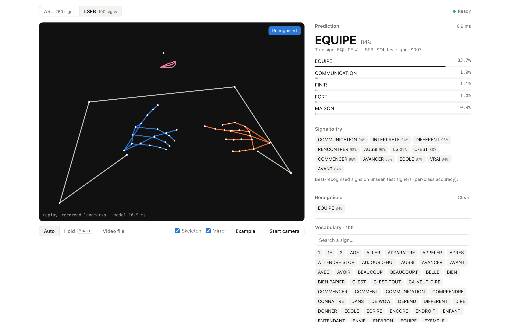
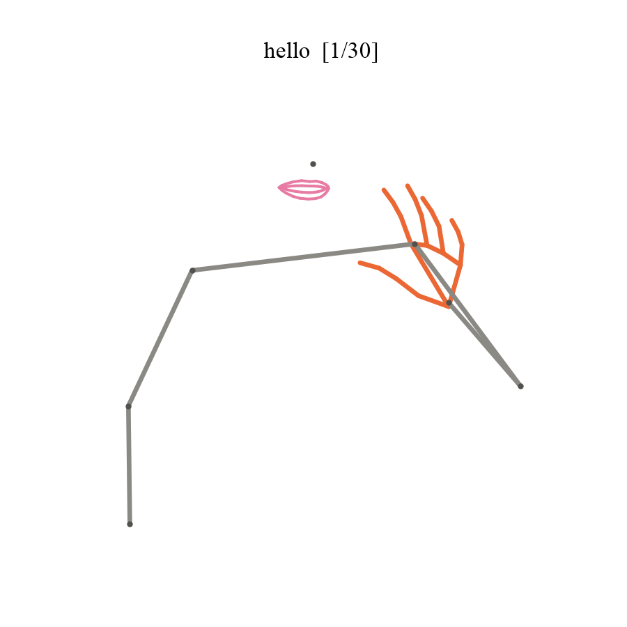
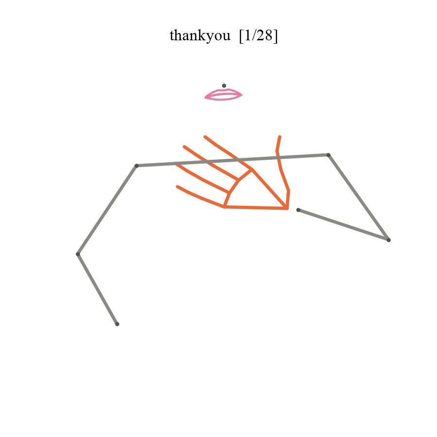
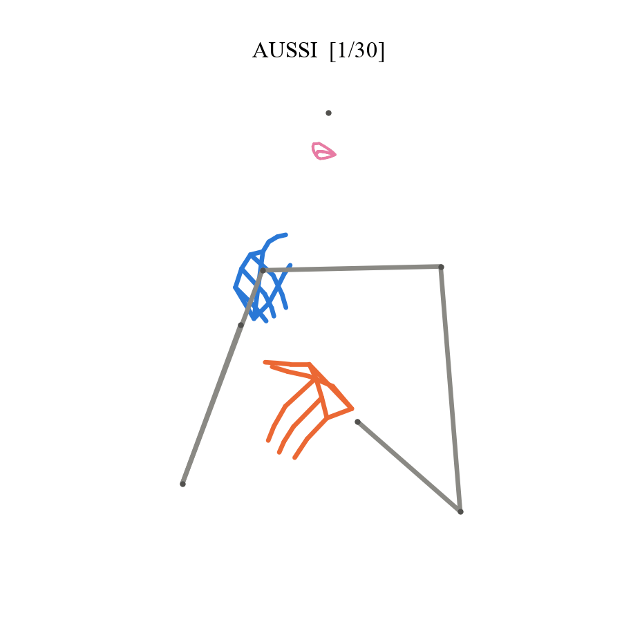
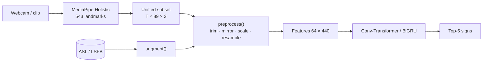

# signrec: isolated sign recognition in the browser

Recognition of isolated signs from MediaPipe Holistic landmarks, evaluated on signers that were
never seen during training. The project also looks at transfer from ASL to French Belgian Sign
Language (LSFB) and ships a web demo that runs entirely client-side (the video never leaves the
device).

Note: this recognises single signs from a fixed vocabulary. It does not translate a sign
language, which has its own grammar and relies heavily on facial expressions.



Landmarks used by the models (two hands, upper body, lips) for one clip of each dataset:

| ASL "hello" | ASL "thank you" | LSFB "AUSSI" (also) |
|---|---|---|
|  |  |  |

## Results

Top-1 accuracy on test signers not seen in training, mean ± std over three seeds, 50 epochs.

| | ASL, 250 signs, 4 test signers | LSFB, 100 signs, 40 test signers |
|---|---|---|
| Chance | 0.4 % | 1.0 % |
| Temporal statistics + logistic regression | 42.1 % | 49.0 % |
| BiGRU (1.4 M params) | 63.0 ± 0.5 % | - |
| Conv-Transformer (2.2 M params) | 64.8 ± 0.4 % | 68.3 ± 0.2 % |
| Conv-Transformer pretrained on ASL, fine-tuned | - | 66.2 ± 0.2 % |
| Ensemble of the three seeds | 67.4 % | 70.9 % |

Main observations:

- A random split (same people in train and test) gives 81.7 % on ASL instead of 64.8 %.
- The Conv-Transformer beats the BiGRU by 1.8 points; a paired bootstrap that also resamples the
  test signers gives a 95 % interval of [0.9, 2.9] points.
- Starting the LSFB model from the ASL weights never helped, from 5 examples per sign up to the
  full corpus; with all data it is slightly but significantly worse (−2.1 points, 95 % interval
  [−2.8, −1.4]). A linear probe on the frozen ASL encoder only reaches 38 %.
- In the ablations, mirroring every clip to a canonical dominant hand matters most. Lips, depth,
  longer sequences and a 3x longer schedule do not help. One ablation looked five times more
  harmful than it is because early stopping fired on a plateau.
- LSFB videos are anamorphic 16:9 PAL, so y has to be rescaled for both corpora to share the
  same body frame.
- Naive dynamic INT8 quantisation drops the Conv-Transformer from 68 % to 34 % because of feature
  outliers. Once fixed, the model is 3.3x smaller but 2.1x slower on CPU, so the demo uses FP32
  (16 ms per sign in the browser).
- The browser pipeline gives the same top-1 prediction as PyTorch on all 40 example clips.

Full report: [`report.pdf`](report.pdf).

## Pipeline



The same `preprocess()` is used for training, evaluation and the browser demo. The demo uses a
JavaScript port whose outputs are compared with the Python version in the test suite.

## Repository layout

```
src/signrec/        landmarks, I/O, preprocessing, augmentation, models, training, evaluation, export
scripts/            data conversion, splits, baselines, Kaggle runs, figures, web assets
configs/            all tunable values (data, preprocessing, augmentation, models, training)
experiments/        lists of training runs (main models, ablations, transfer study)
splits/             frozen signer-independent splits
app/web/            browser demo (MediaPipe Tasks JS + onnxruntime-web)
report.pdf          full report (English)
reports/            evaluation reports, training histories, dataset statistics
tests/              pytest suite (plus Node tests for the JavaScript code)
```

## Reproducing

```bash
make install
make test

# data (accept the asl-signs competition rules on kaggle.com first)
uv run python scripts/build_kaggle_kernel.py --push          # conversion runs on Kaggle
kaggle kernels output <user>/asl-signs-unified-subset -p data/processed/
uv run python scripts/convert_lsfb.py                        # streams the LSFB-ISOL poses
uv run python scripts/make_splits.py --dataset kaggle_asl
uv run python scripts/make_splits.py --dataset lsfb_isol

# training, locally or on a Kaggle GPU
uv run python -m signrec.train --config configs/train.yaml
uv run python scripts/kaggle_train.py --experiments experiments/asl_main.yaml --push
uv run python scripts/run_baseline.py --data data/processed/kaggle_asl \
    --split splits/kaggle_asl_signer.json --eval-test

# significance tests, LSFB validation/test analysis, figures and tables, report, demo
make analysis
make figures
make paper
uv run python scripts/export_web_assets.py --model asl=models/asl-transformer-s0/best.pt
uv run python scripts/screenshot_demo.py
make web                                                     # http://localhost:8080
```

## Demo

`make web` serves `app/web/` locally. There are three capture modes: Auto (signs are segmented
from hand presence and motion), Hold Space (manual recording) and Video file. The page shows the
skeleton, the top-5 predictions, the signs the model recognises best, the history and the
vocabulary. "Example" replays one of 40 LSFB-ISOL test clips shipped with the demo.

## Data and licences

- Google Isolated Sign Language Recognition (Kaggle, 2023): competition rules, not redistributed.
- LSFB-ISOL v2: CC BY 4.0. Cite Fink et al. (IJCNN 2021) and Meurant (2015).
- See [data/README.md](data/README.md) for the sources and [MODEL_CARD.md](MODEL_CARD.md) for the
  limitations of the models.
